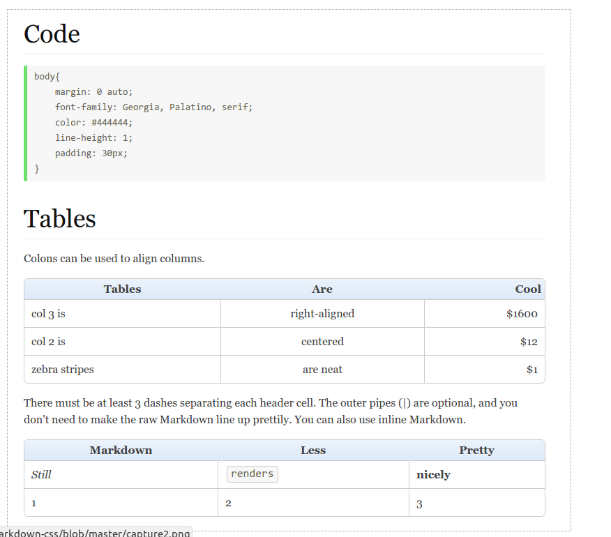
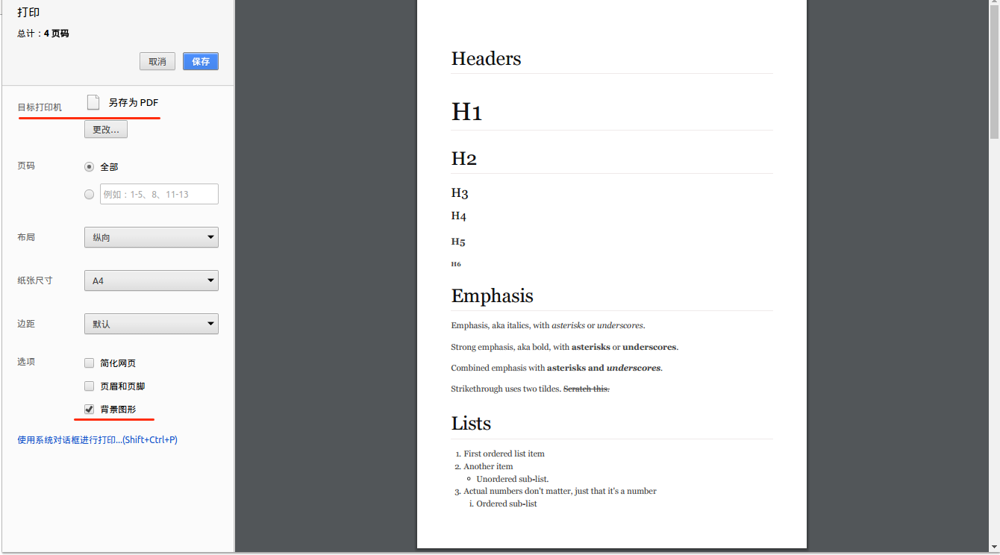

# markdown-css

## 使用
本样式在[这个样式](https://bitbucket.org/kevinburke/markdowncss)的基础上做了一些修改， 主要是对于表格和代码块以及一些细节的修改。 主要目的是用在chrome的扩展 [Markdown Preview Plus](https://chrome.google.com/webstore/detail/markdown-preview-plus/febilkbfcbhebfnokafefeacimjdckgl?utm_source=chrome-app-launcher-info-dialog)中， 替换其内置的样式。 由于 Markdown Preview Plus对css文件大大小有要求（小于8K）， 所以需要使用压缩后的 [css文件](markdown.min.css)。 当然也可以作为一个单独的markdown样式来使用

[预览该样式](http://zhangjikai.com/markdown-css/)  
  
**部分截图**




## 导出html
Markdown Preview Plus 提供了导出 html 的功能，不过导出后的格式是 xhtml，可以去 [这里](https://sourceforge.net/projects/mht2htm/?source=typ_redirect) 下载转换工具，将 xhtml 转为html。 如果运行转换工具时报下面的错误
```
./mht2htm: error while loading shared libraries: libgdk_pixbuf-2.0.so.0: cannot open shared object file: No such file or directory
```
只要运行下面的命令即可
```
sudo apt-get install libgtk2.0-0:i386
```

## 导出PDF
导出pdf主要是借助于Chrome的打印功能， 在网页空白处右击， 选择 `打印(P)...` 选项， 出来打印页面后将 **目标打印机** 改为 **另存为PDF** ，同时勾选上 **背景图形** 选项， 如下图:  
  


这里是一个[示例文件](sample.pdf)  

